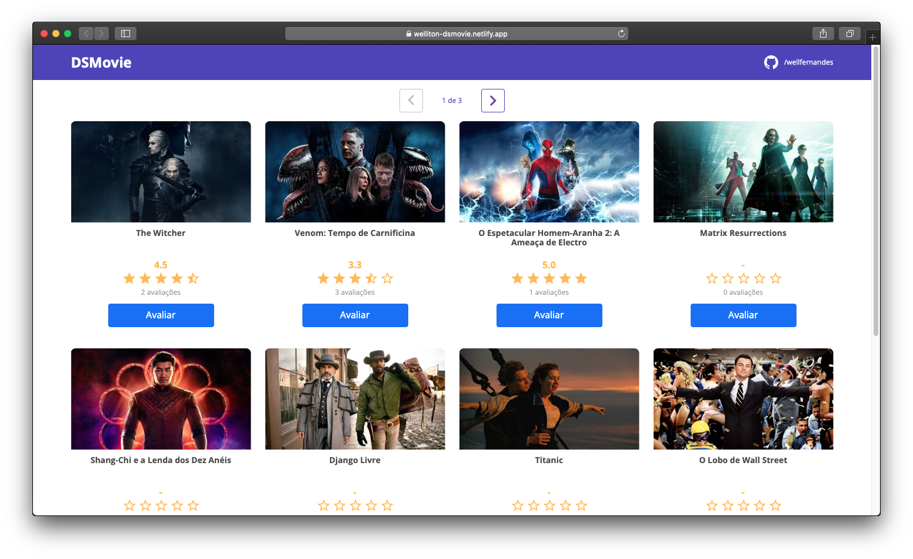

# DSmovie

Projeto dsmovie desenvolvido durante o evento Semana Spring React. 

## 🚀 Descrição

Projeto web desenvolvido utilizando Java com Spring Boot no back end e TypeScript com ReactJS no front end.
O deploy da aplicação foi realizado na plataforma Heroku utilizando Netlify.

### 👓 Visualizar

A aplicação dsmovie pode ser acessada pelo link:

* [dsmovie](https://welliton-dsmovie.netlify.app) - Aplicação dsmovie em produção. (Insdisponível temporariamente)

---
[Linkedin](https://www.linkedin.com/in/wellitonfernandes/) 😊